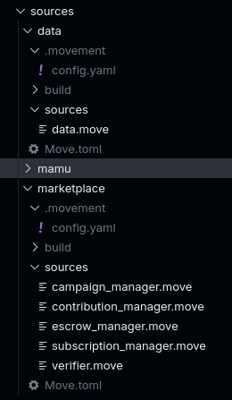
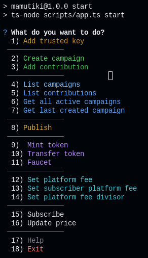

# How to run the Datagora backend project:

1. Install dependencies: `npm install`
2. Install Movement CLI: [Official Movement CLI Setup Guide](https://docs.movementnetwork.xyz/devs/movementcli)
3. Initialize movement account in two separate module folder.

   - sources/data: `movement init --skip-faucet`
   - sources/marketplace: `movement init --skip-faucet`
   - for both, you will do the same process:

     - select network as "custom" and then press enter.
     - after that, movement cli will request rest url, write the url which you want to use.
       we recommend using bardock testnet for testing. `https://aptos.testnet.bardock.movementlabs.xyz/v1`
     - then you will get private key, public key, account address in both .movement folder, please change network from "Custom" to "Testnet".

     ***

   on sources/data:

   - Use `movement move init --name Data` command to initialize the project.
   - In Move.toml file, add the following to the [addresses] section:

     ```toml
     [addresses]
     data = "account_address_in_the_.movement_folder"
     ```

   on sources/marketplace:

   - Use `movement move init --name Marketplace` command to initialize the project.
   - In Move.toml file, add the following to the [addresses] and [dependencies] section:

   ```toml
    [addresses]
    marketplace = "account_address_in_the_.movement_folder"

    [dependencies]
    AptosFramework = { git = "https://github.com/aptos-labs/aptos-core.git", rev = "mainnet", subdir = "aptos-move/framework/aptos-framework"}
    Data = {local = "../data"}
   ```

   Afterall your folders in sources, should look like this:

   

4. Create .env file using .env.example file:

   - In that file you should fill it like this.

   ```env
   NODE_URL=https://aptos.testnet.bardock.movementlabs.xyz/v1
   FAUCET_URL=https://fund.testnet.bardock.movementlabs.xyz/

   ACCOUNT_PRIVATE_KEY=(your_any_movement_account_private_key)

   MODULE_PRIVATE_KEY=(marketplace_module_private_key)
   MODULE_ADDRESS=(marketplace_module_address)

   TOKEN_MODULE_PRIVATE_KEY=(token_module_private_key)
   TOKEN_MODULE_ADDRESS=(token_module_address)

   TEST=(choose true or false)
   ```

5. Use `npm start` to interact with the modules or deploy it to the network.
   -If it works properly, you should see the following output:

   

6. You can use publish command to publish the module to the network.

- We need $MOVE for both DATA and MARKETPLACE module addresses.
- To cover this, we recommend to use "https://faucet.movementnetwork.xyz/?network=bardock"
- Before publishing the modules you must publish the DATA module first.
- Then, you can publish the MARKETPLACE module. Because the MARKETPLACE module belongs to DATA module and its address.

## Additional Notes:

- Marketplace module is using $DATA as its native token. So you need to have some $DATA in your account to interact with the module.
- You can have $DATA from the $DATA faucet.
- You must have add the "trusted public key" before initializing the create campaign function. It can be any secure account that YOU only have the access to it. We recommend using the marketplace module account for this.
